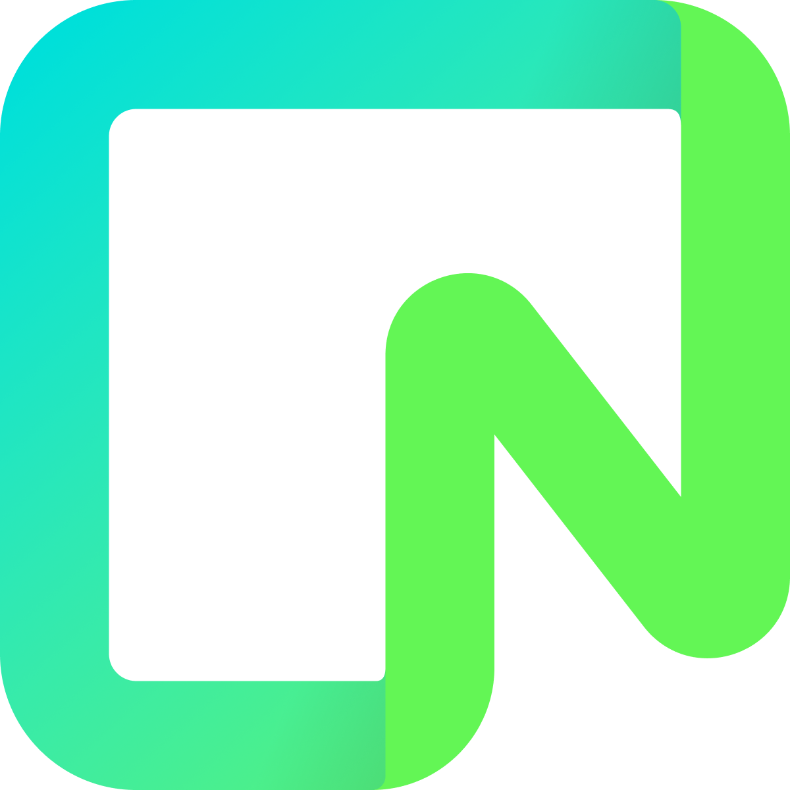
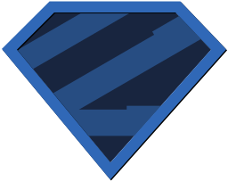

# 👋Introduction 

Hi, I’m Tim a French student in IT, currently in 3rd year of a Bachelor in Computer Science at IUT Charlemagne in Nancy.

I would like to become a full-stack or a front-end (not decided yet) React Js developer to work on various projects with cutting edge Javascript frameworks such as Next Js.

I also like working on little projects like as my personal portfolio or little web applications.

You can see my portfolio at [this link](https://portfolio.timeuh.fr/)

# 💻Technologies

## 📱Technologies I know

## 🔨Tools I know

  
  
  
  
  

## 🎓Currently learning

  
  

## 🔍Wanting to learn

# 🚀Projects
## 🚦Current Project : ✅Done

## 🖹 Wankul API
API and backend to manage cards data of a trading card game created by Wankil Studio, [see here](https://wankul.fr/collections/cartes) for the original game.

  
  
  

## 🃏 WankulDex
Display site for each Wankul card, using my Wankul API.
#### ℹ️ Vew at [WankulDex](https://wankuldex.timeuh.fr)

  
  
  
  
  

# 📚 Other Projects

### 🧑🏻‍💻 Personal Portfolio V2  🖱️[see code here](https://github.com/Timeuh/Portfolio-v2)

### 💻 Pinit 🖱️[see code here](https://github.com/Timeuh/Pinit)

### 🧑🏻‍💻 Personal Portfolio V1 🖱️[see code here](https://github.com/Timeuh/Portfolio)

### 🎜 Spotifree 🖱️[see code here](https://github.com/Timeuh/Spotifree)

# 📈My stats

