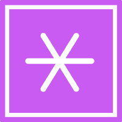
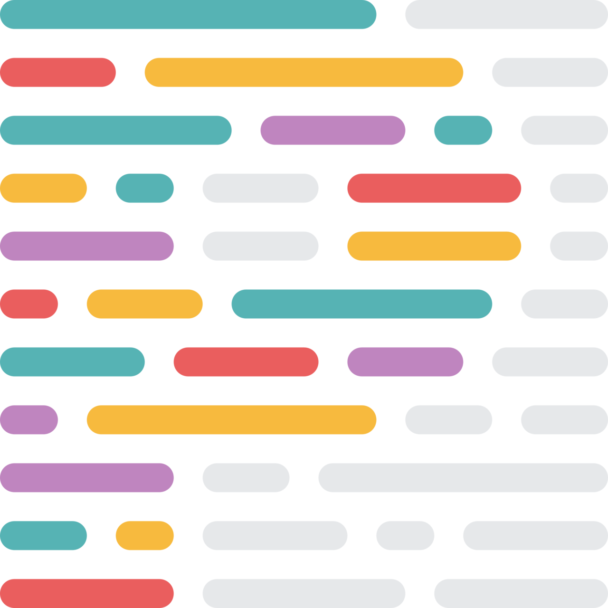
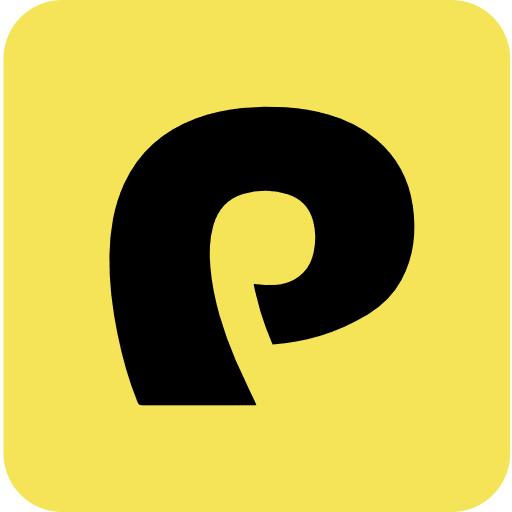
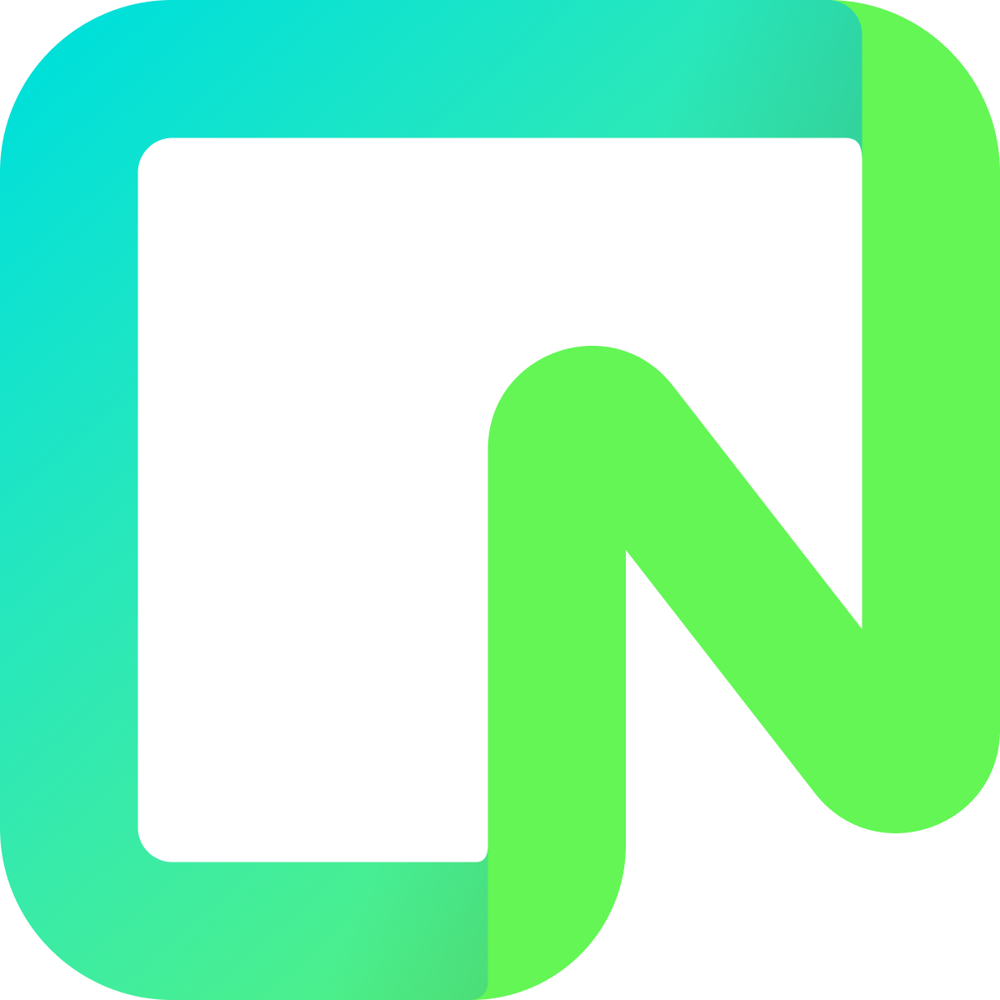

# 👋Introduction 
Hi, I’m Tim, currently in internship as a web developer until 10/2028.
I am a fullstack web developer, with a preference for the frontend. I love doing small or medium projects when I have an idea, though I don't finish all of them.
I've got a portfolio you can see on [this link](https://timeuh.fr) !

# 🚀 My Projects
## 🚦Current Project :
### 🥘 Gourmand
A web app to log the foods you eat on day-to-day basis. It helps you track the diversity of the food you eat from your own recipes, and let you customize you monthly objective of different eaten foods.

## 📚 Other Projects
### 🧑🏻‍💻 New Portfolio
Most recent iteration of my portfolio. I wanted to do a more minimalistic site focused on the information I wanted to show.
#### 🖱️[see code here](https://github.com/Timeuh/portnewlio), ℹ️ View at [Portfolio](https://timeuh.fr)

  
  
  
  
  

### 🧑🏻‍💻 Old Portfolio
My old portfolio, using all my knowledge at this time, including Next Js, Prisma, React-Query.
Also the occasion to learn optimistic updates (managing experiences and technologies part of the site) and Panda CSS.
#### 🖱️[see code here](https://github.com/Timeuh/Portfolio), ℹ️ View at [old portfolio](https://portfolio.timeuh.fr)

  
  
  
  
  
  

### 🃏 WankulDex
Display site for each Wankul card, using my Wankul API.
#### 🖱️[see code here](https://github.com/Timeuh/Wankuldex), ℹ️ Not online anymore

  
  
  
  
  

### 🖹 Wankul API
API and backend to manage cards data of a trading card game created by Wankil Studio, [see here](https://wankul.fr/apps/wankul/wankuldex) for the original game.
#### 🖱️[see code here](https://github.com/Timeuh/Wankul-API)

  
  
  

### 🧑🏻‍💻 Personal Portfolio V2
Second iteration of my portfolio, I wanted to try things with the design and interactivity.
#### 🖱️[see code here](https://github.com/Timeuh/Portfolio-v2), ℹ️ View at [portfolio v2](https://portfolio-v2.timeuh.fr)

  

