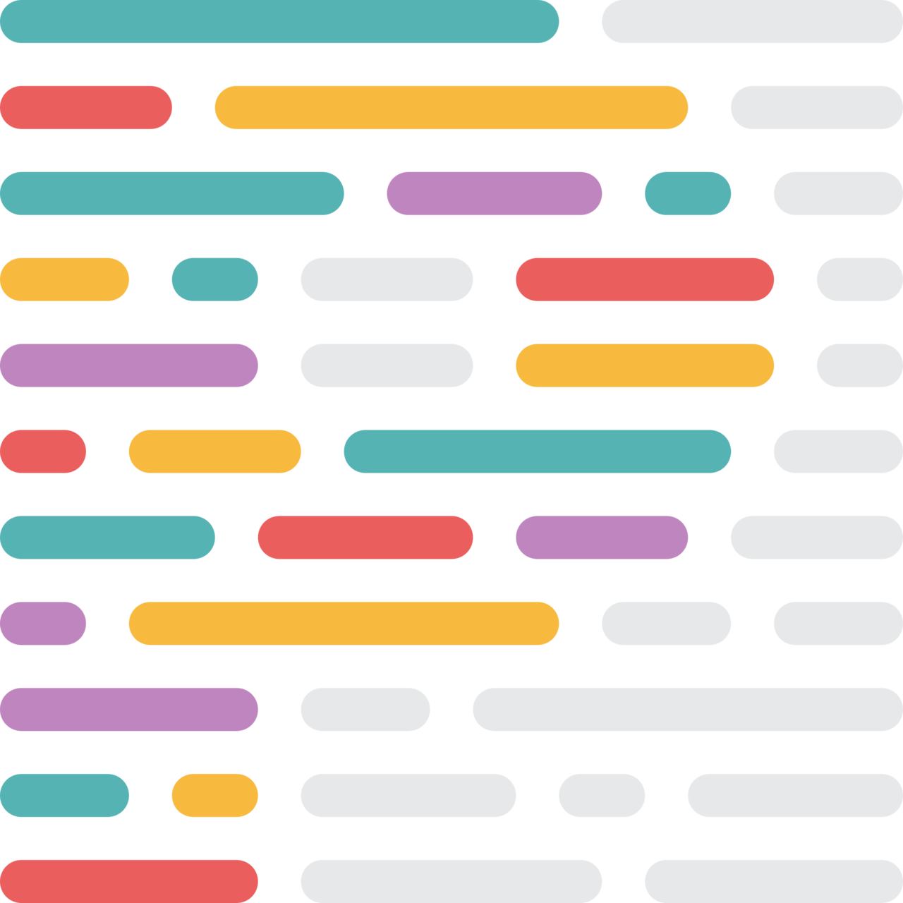

# 👋Introduction 

Hi, I’m Tim, I have just graduated with a Bachelor's degree in Computer Science from IUT Charlemagne in Nancy.

I am a fullstack React Js developer, with a preference for the frontend. I am used to work on projects with cutting edge Javascript frameworks such as Next Js.

I also like working on little projects like my personal portfolio or little web applications.

You can see my portfolio at [this link](https://timeuh.fr)

# 💻Technologies

## 📱Technologies I know

## 🔨Tools I know

  
  

# 🚀Projects
## 🚦Current Project :

### 💡QuizzTure
A web game based on general culture questions with different game modes. Play with your friends on private game rooms !

## 📚 Other Projects

### 🧑🏻‍💻 New Portfolio 🖱️[see code here](https://github.com/Timeuh/Portfolio)
My new portfolio, using all of my current knowledge, including Next Js, Prisma, React-Query.
Also the occasion to learn optimistic updates (managing experiences and technologies part of the site) and Panda CSS.
#### ℹ️ Vew at [Portfolio](https://timeuh.fr)

  
  
  
  
  

### 🃏 WankulDex 🖱️[see code here](https://github.com/Timeuh/Wankuldex)
Display site for each Wankul card, using my Wankul API.
#### ℹ️ Vew at [WankulDex](https://wankuldex.timeuh.fr)

  
  
  
  
  

### 🖹 Wankul API 🖱️[see code here](https://github.com/Timeuh/Wankul-API)
API and backend to manage cards data of a trading card game created by Wankil Studio, [see here](https://wankul.fr/collections/cartes) for the original game.

  
  
  

### 🧑🏻‍💻 Personal Portfolio V2  🖱️[see code here](https://github.com/Timeuh/Portfolio-v2)

### 💻 Pinit 🖱️[see code here](https://github.com/Timeuh/Pinit)

### 🧑🏻‍💻 Personal Portfolio V1 🖱️[see code here](https://github.com/Timeuh/Portfolio)

### 🎜 Spotifree 🖱️[see code here](https://github.com/Timeuh/Spotifree)

# 📈My stats

