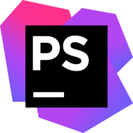

# 👋Introduction 

Hi, I’m Tim a French student in IT, currently in 2nd year of a Bachelor in Computer Science at IUT Charlemagne in Nancy.

I would like to become a full-stack or a front-end (not decided yet) web developer to work on various projects with cutting edge Javascript frameworks.

I also like working on little projects such as my personal portfolio or little web applications, or some 
little Java minecraft plugins for me and my friends.

You can see my portfolio at [this link](https://portfolio.timeuh.live/)

# 💻Technologies

### 📱Technologies I know

### 🔨Tools I know

  
  
  
  

### 🎓Currently learning

  

### 🔍Wanting to learn

# 🚀Projects
## 🚦Current Project

- ### 🖹 Wankul API
API and backend to manage cards data of a trading card game created by Wankil Studio, [see here](https://wankul.fr/collections/cartes) for the original game.

- ### 🃏 WankulDex
Display site for each Wankul card, using my Wankul API.

#### ℹ️ Currently in development, come back later !

## 📚 Other Projects

### 🧑🏻‍💻 Personal Portfolio V2  🖱️[see code here](https://github.com/Timeuh/Portfolio-v2)

### 💻 Pinit 🖱️[see code here](https://github.com/Timeuh/Pinit)

### 🧑🏻‍💻 Personal Portfolio V1 🖱️[see code here](https://github.com/Timeuh/Portfolio)

### 🎜 Spotifree 🖱️[see code here](https://github.com/Timeuh/Spotifree)

# 📈My stats

